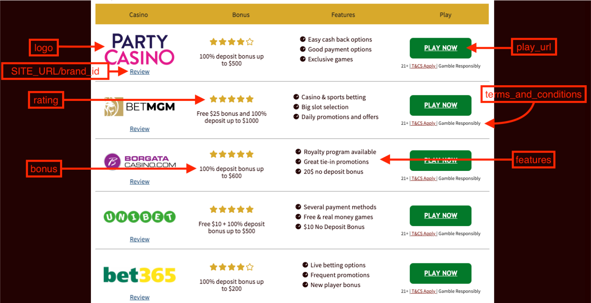

##Experienced Wordpress Developer Coding Exercise

The goal of this exercise is for you to create a Wordpress plugin which will fetch an array of reviews
from an external REST API and display them in a nice list to the user.
The API returns data in JSON format (see attached file for a sample response).
You are free to use any method you prefer to mock the REST API and have your plugin load the data
from the mock API with the sample JSON response.
The finished list of reviews as presented to the user by your plugin should look like the following:

The red arrows & text indicate which keys you need to use from each JSON object to populate the
corresponding review in the list (you should not display the red text & arrows to the end user).

#### Requirements:
1. The review list should be responsive and appear without issues in both mobile and desktop
devices.
2. The JSON file contains multiple arrays of review objects. You need to display only those
under the key 575.
3. Each review on the list should be populated from the data of a single object in the JSON
array.
4. Review objects in the JSON array may appear out of order. The default position that each
review should appear on the list for the end user should be according to the order key in
the JSON object, and not based on the position of the object in the array.
5. In the WP admin area, the plugin should show a form with a drag and drop list of the review
objects. The administrator should be able to reorder the list and when the form is saved
then the order of the reviews in the frontend should match the order set in the drag and
drop form.
6. The word “Review” under the logo image and the logo image should link to /brand_id,
where brand_id is the value found under the brand_id key in the corresponding JSON
object.
7. The “PLAY NOW” button should link to the value found under the play_url key in the
corresponding JSON object.
8. The plugin should be installed in a publicly hosted & accessible Wordpress installation.
9. All code needs to be in a code versioned repository of your choice, with detailed commits.
10. All code needs to be well commented.
11. Commit frequently instead of once in the end.

Kindly send us the repo link together with the site link for us to review.